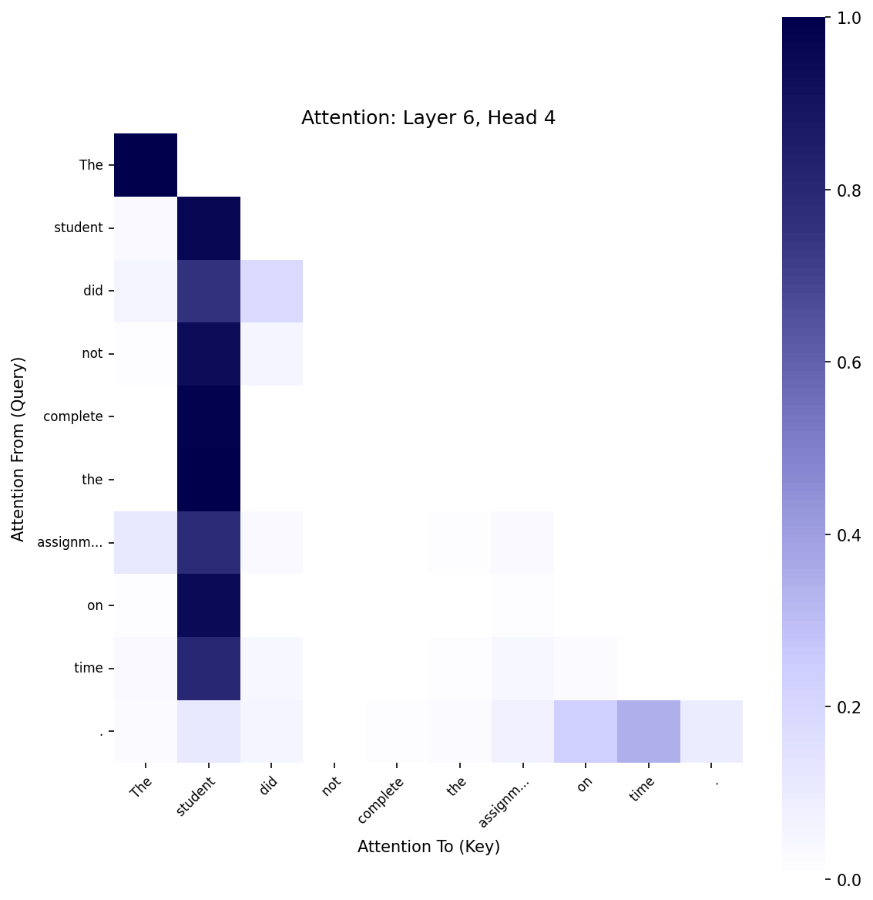
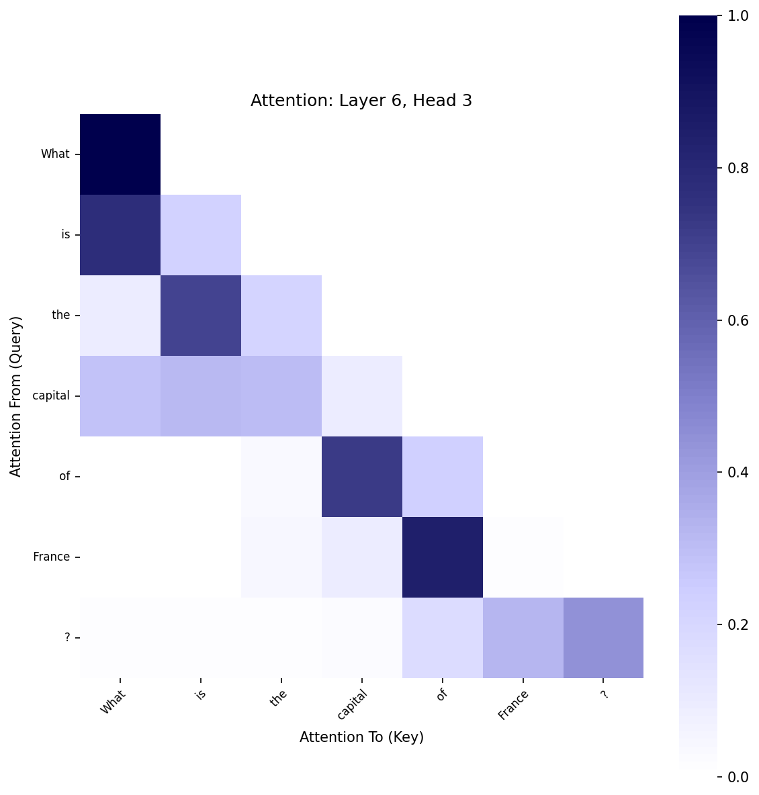

# Transformer Interpretability Analysis: base_transformer_for_interpretability

## Overview

This report analyzes the attention patterns in a transformer model with the following architecture:

- Embedding size: 448
- Number of layers: 8
- Number of attention heads per layer: 7
- Context size: 384-512 tokens

## Analyzed Sentences

1. `The cat sat on the mat.`
2. `The student who studied hard for the exam passed with flying colors.`
3. `The keys, which I had left on the kitchen counter this morning, are now missing.`
4. `John said that he would finish the project by Friday.`
5. `The student did not complete the assignment on time.`
6. `What is the capital of France?`
7. `Transformers use self-attention mechanisms to weigh the importance of different words in a sequence.`
8. `The professor lectured on the topic with enthusiasm.`
9. `This book is better than that one.`
10. `First, preheat the oven, then prepare the ingredients, and finally bake for 30 minutes.`

## Attention Head Behavior Analysis

Attention heads exhibit different behaviors across sentences and language contexts. We categorize heads into several behavioral types:

- **Diagonal/Self**: Heads that primarily attend to the current token or immediately adjacent tokens
- **Local Context**: Heads that focus on nearby tokens within a short window
- **Global/Broad**: Heads that distribute attention broadly across the sequence
- **Token-Specific**: Heads that focus attention on specific token types (e.g., punctuation, certain parts of speech)

### Head Behavior Summary Table

| Layer | Head | Primary Behavior | Confidence | Sample Count |
| --- | --- | --- | --- | --- |
| 1 | 1 | Global | 100.0 | 10 |
| 1 | 2 | Global | 100.0 | 10 |
| 1 | 3 | Global | 70.0 | 10 |
| 1 | 4 | Global | 100.0 | 10 |
| 1 | 5 | Global | 70.0 | 10 |
| 1 | 6 | Global | 100.0 | 10 |
| 1 | 7 | Global | 90.0 | 10 |
| 2 | 1 | Global | 80.0 | 10 |
| 2 | 2 | Global | 90.0 | 10 |
| 2 | 3 | Global | 90.0 | 10 |
| 2 | 4 | Global | 100.0 | 10 |
| 2 | 5 | Global | 100.0 | 10 |
| 2 | 6 | Global | 90.0 | 10 |
| 2 | 7 | Global | 90.0 | 10 |
| 3 | 1 | Global | 100.0 | 10 |
| 3 | 2 | Global | 100.0 | 10 |
| 3 | 3 | Global | 100.0 | 10 |
| 3 | 4 | Global | 100.0 | 10 |
| 3 | 5 | Global | 90.0 | 10 |
| 3 | 6 | Global | 100.0 | 10 |
| 3 | 7 | Global | 90.0 | 10 |
| 4 | 1 | Global | 100.0 | 10 |
| 4 | 2 | Global | 100.0 | 10 |
| 4 | 3 | Global | 100.0 | 10 |
| 4 | 4 | Global | 100.0 | 10 |
| 4 | 5 | Global | 100.0 | 10 |
| 4 | 6 | Global | 100.0 | 10 |
| 4 | 7 | Global | 90.0 | 10 |
| 5 | 1 | Global | 100.0 | 10 |
| 5 | 2 | Global | 100.0 | 10 |
| 5 | 3 | Global | 60.0 | 10 |
| 5 | 4 | Global | 100.0 | 10 |
| 5 | 5 | Global | 100.0 | 10 |
| 5 | 6 | Global | 100.0 | 10 |
| 5 | 7 | Global | 100.0 | 10 |
| 6 | 1 | Global | 100.0 | 10 |
| 6 | 2 | Global | 100.0 | 10 |
| 6 | 3 | Local | 60.0 | 10 |
| 6 | 4 | Global | 90.0 | 10 |
| 6 | 5 | Global | 100.0 | 10 |
| 6 | 6 | Global | 100.0 | 10 |
| 6 | 7 | Global | 100.0 | 10 |
| 7 | 1 | Global | 100.0 | 10 |
| 7 | 2 | Global | 100.0 | 10 |
| 7 | 3 | Global | 100.0 | 10 |
| 7 | 4 | Global | 100.0 | 10 |
| 7 | 5 | Global | 100.0 | 10 |
| 7 | 6 | Global | 70.0 | 10 |
| 7 | 7 | Global | 100.0 | 10 |
| 8 | 1 | Global | 90.0 | 10 |
| 8 | 2 | Global | 100.0 | 10 |
| 8 | 3 | Global | 40.0 | 10 |
| 8 | 4 | Global | 80.0 | 10 |
| 8 | 5 | Global | 100.0 | 10 |
| 8 | 6 | Global | 90.0 | 10 |
| 8 | 7 | Global | 100.0 | 10 |

## Head Similarity Analysis

Heads that share similar attention patterns across sentences may be performing related functions. We analyze the similarity between heads:

## Interesting Attention Patterns

Here we highlight some of the most interesting attention patterns found:

### Pattern 1: Layer 7, Head 6

- **From Token**: ` of`
- **To Token**: ` importa...`
- **Attention Weight**: 1.000
- **Sentence Context**: `Transformers use self-attention mechanisms to weigh the importance of different words in a sequence.`

### Pattern 2: Layer 6, Head 4

- **From Token**: ` the`
- **To Token**: ` student`
- **Attention Weight**: 0.996
- **Sentence Context**: `The student did not complete the assignment on time.`

### Pattern 3: Layer 8, Head 6

- **From Token**: ` lect`
- **To Token**: ` professor`
- **Attention Weight**: 0.995
- **Sentence Context**: `The professor lectured on the topic with enthusiasm.`

### Pattern 4: Layer 4, Head 7

- **From Token**: ` not`
- **To Token**: ` student`
- **Attention Weight**: 0.994
- **Sentence Context**: `The student did not complete the assignment on time.`

### Pattern 5: Layer 8, Head 4

- **From Token**: `ured`
- **To Token**: ` professor`
- **Attention Weight**: 0.994
- **Sentence Context**: `The professor lectured on the topic with enthusiasm.`

## Visualization Examples

This section shows examples of different visualizations created for the attention patterns.

### Attention Heatmaps

Heatmaps show the attention weight from each token (y-axis) to each token (x-axis):

### Attention Flow Graphs

Flow graphs visualize how attention flows between tokens, with edge thickness indicating attention strength:

